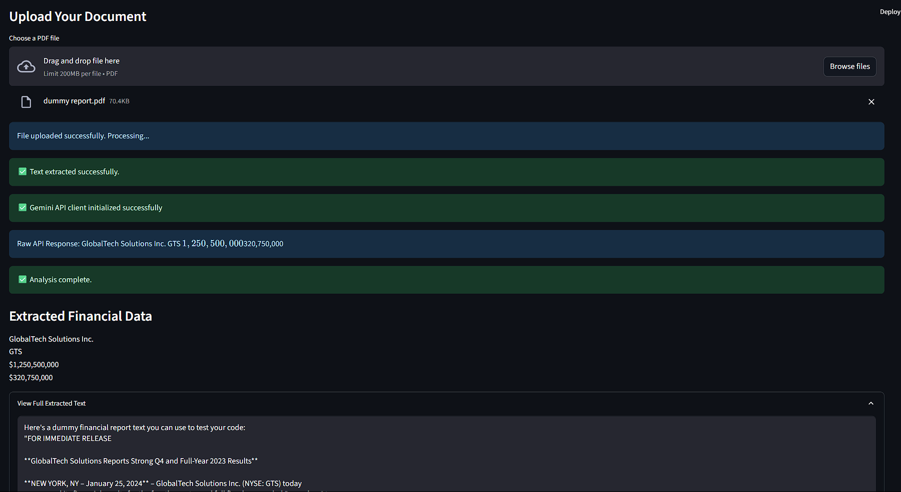

# 📄 Finance Data Extraction with Gemini AI

A Streamlit web app that extracts key financial information from uploaded PDF financial reports using Google's Gemini AI.

---

## 🚀 Features

- **PDF Upload:** Upload any financial report in PDF format.
- **Automatic Text Extraction:** Extracts text from PDF using `pypdf`.
- **AI-Powered Data Extraction:** Uses Gemini AI to identify and extract:
  - Company Name
  - Stock Symbol
  - Revenue
  - Net Income
- **User-Friendly Interface:** Built with Streamlit for easy interaction.
- **API Connection Test:** Test your Gemini API connection with sample data.

---

## 🖥️ Demo



---

## 🛠️ Installation

1. **Clone the repository:**
    ```sh
    git clone https://github.com/yourusername/FinanceDataExtraction.git
    cd FinanceDataExtraction
    ```

2. **Install dependencies:**
    ```sh
    pip install -r requirements.txt
    ```

3. **Set up your Google Gemini API key:**
    - Create a `.streamlit/secrets.toml` file:
      ```
      GOOGLE_API_KEY = "your-google-gemini-api-key"
      ```
    - **Never share your API key publicly!**

---

## ⚡ Usage

1. **Run the app:**
    ```sh
    streamlit run app.py
    ```

2. **In your browser:**
    - Upload a PDF financial report.
    - View extracted financial data.
    - Optionally, test the Gemini API connection with sample data.

---

## 📂 Project Structure

```
.
├── app.py                  # Streamlit app
├── data_extractor.py       # Gemini AI integration
├── pdf_processor.py        # PDF text extraction
├── config.py               # API key management
├── requirements.txt
└── .streamlit/
    └── secrets.toml        # (Not included in repo; for your API key)
```

---

## 📝 Notes

- This app does **not** store your uploaded files or extracted data.
- Only text-based PDFs are supported (scanned/image-only PDFs will not work).
- Make sure your Google API key has access to the Gemini API.

---

## 📄 License

[MIT License](LICENSE)

---

## 🙏 Acknowledgements

- [Streamlit](https://streamlit.io/)
- [pypdf](https://pypdf.readthedocs.io/)
- [Google Gemini API](https://ai.google.dev/)

---

*Feel free to open issues or contribute!*